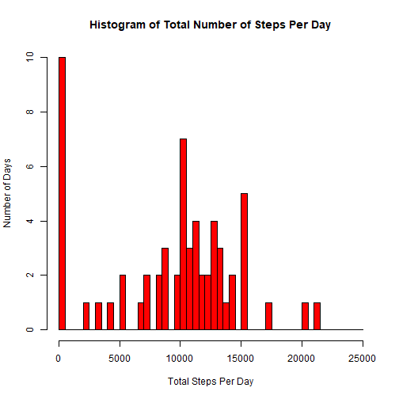
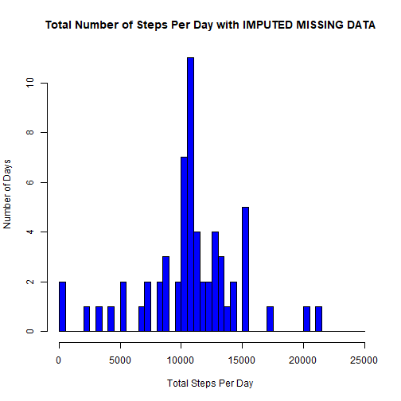
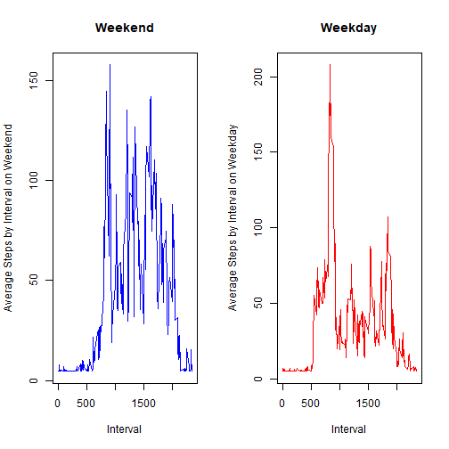

## R Markdown
## Loading and preprocessing the data

```r
library(ggplot2)
library(dplyr)
wd<-setwd("C:/Users/c ford/Documents/Reproducible research/Week2")
if(!file.exists("activity.zip")){
  download.file("https://d396qusza40orc.cloudfront.net/repdata%2Fdata%2Factivity.zip", destfile = "activity.zip")
    unzip("activity.zip", exdir = wd)
    }
activity<-read.csv("activity.csv")
```
## What is mean total number of steps taken per day?
Make a histogram of the total number of steps taken each day

```r
bydate<-split(activity,activity$date)
meansteps<-lapply(bydate,function(x){mean(x[,1],na.rm=TRUE)})
sumsteps<-lapply(bydate,function(x){sum(x[,1],na.rm=TRUE)})

sumsteps_frame<-as.data.frame(unlist(sumsteps))
sumsteps_frame$dates<-row.names(sumsteps_frame)

hist_steps1<-hist(sumsteps_frame$`unlist(sumsteps)`, breaks = seq(0,25000,by=500), main="Histogram of Total Number of Steps Per Day", col="red",xlab="Total Steps Per Day",ylab="Number of Days")
```


<br> Calculate and report the mean and median of the total number of steps taken per day

```r
paste("Mean total steps taken per day is",mean(sumsteps_frame$`unlist(sumsteps)`))
```

```
## [1] "Mean total steps taken per day is 9354.22950819672"
```

```r
paste("Median total steps taken per day is",median(sumsteps_frame$`unlist(sumsteps)`))
```

```
## [1] "Median total steps taken per day is 10395"
```
## What is the average daily activity pattern?
Make a time series plot of the 5-minute interval (x-axis) and the average number of steps taken, averaged across all days (y-axis)

```r
byinterval<-split(activity,activity$interval)
meaninterval<-lapply(byinterval,function(x){mean(x[,1],na.rm=TRUE)})
meaninterval_frame<-as.data.frame(unlist(meaninterval))
meaninterval_frame$interval<-row.names(meaninterval_frame)

int<-ggplot(data=meaninterval_frame, aes(x=as.numeric(interval), y=`unlist(meaninterval)`), ylim=)
int+geom_line(color= "#FF5733", size=1)+labs(title="Average Number of Steps Per Time Interval", x="Intervals", y="Average Steps")
```


<br> Which 5-minute interval, on average across all the days in the dataset, contains the maximum number of steps?

```r
high<-meaninterval_frame[order(meaninterval_frame$`unlist(meaninterval)`,decreasing = TRUE),]
paste("Interval with highest average steps is",high[1,2])
```

```
## [1] "Interval with highest average steps is 835"
```
## Imputing missing values
Calculate and report the total number of missing values in the dataset (i.e. the total number of rows with na). 

```r
missingcount<-complete.cases(activity)
paste(table(missingcount)[1],"rows with missing values")

```

```
## [1] "2304 rows with missing values"
```
Devise a strategy for filling in all of the missing values in the dataset. The strategy does not need to be sophisticated. For example, you could use the mean/median for that day, or the mean for that 5-minute interval, etc. Create a new dataset that is equal to the original dataset but with the missing data filled in.

```r
"I filled in the missing data with the average steps of the entire dataset."
activityfill<-activity
activityfill$steps[is.na(activityfill$steps)]<-mean(activity$steps,na.rm=TRUE) 
```
Make a histogram of the total number of steps taken each day and Calculate and report the mean and median total number of steps taken per day. Do these values differ from the estimates from the first part of the assignment? What is the impact of imputing missing data on the estimates of the total daily number of steps?

```r
bydate2<-split(activityfill,activityfill$date)

sumsteps2<-lapply(bydate2,function(x){sum(x[,1],na.rm=TRUE)})

sumsteps_frame2<-as.data.frame(unlist(sumsteps2))
sumsteps_frame2$dates<-row.names(sumsteps_frame2)

hist_steps2<-hist(sumsteps_frame2$`unlist(sumsteps2)`, breaks = seq(0,25000,by=500), main="Total Number of Steps Per Day with IMPUTED MISSING DATA ", col="blue", xlab="Total Steps Per Day ",ylab="Number of Days")
```



```r
paste("Mean is ",mean(sumsteps_frame2$`unlist(sumsteps2)`))
```

```
## [1] "Mean is  10766.1886792453"
```

```r
paste("Median is ",median(sumsteps_frame2$`unlist(sumsteps2)`))
```

```
## [1] "Median is  10766.1886792453"
```

```r
"These values are different than the mean and median in the first segment and are slightly higher than the original mean and median of average daily total steps."
```

```
## [1] "These values are different than the mean and median in the first segment and are slightly higher than the original mean and median of average daily total steps."
```
## Are there differences in activity patterns between weekdays and weekends?
Create a new factor variable in the dataset with two levels – “weekday” and “weekend” indicating whether a given date is a weekday or weekend day.

```r
activityfill$date2<-as.Date(activityfill$date)
activityfill$day<-weekdays(activityfill$date2)
    for (i in 1:length(activityfill$day)){
  activityfill$whichday[i]<-ifelse("Saturday" %in% activityfill$day[i] || "Sunday" %in% activityfill$day[i], "Weekend", "Weekday")}
```
Make a panel plot containing a time series plot  of the 5-minute interval (x-axis) and the average number of steps taken, averaged across all weekday days or weekend days (y-axis). 

```r
weekend<-activityfill %>% filter(whichday=="Weekend")
weekday<-activityfill %>% filter(whichday=="Weekday")

wend_int<-split(weekend,weekend$interval)
wday_int<-split(weekday,weekday$interval)

mean_wend_int<-lapply(wend_int, function(x) {mean(x[,1],is.na=TRUE)})
mean_wday_int<-lapply(wday_int, function(x) {mean(x[,1],is.na=TRUE)})

mean_wend_int_frame<-as.data.frame(unlist(mean_wend_int))
mean_wday_int_frame<-as.data.frame(unlist(mean_wday_int))

mean_wend_int_frame$interval<-row.names(mean_wend_int_frame)
mean_wday_int_frame$interval<-row.names(mean_wday_int_frame)
par(mfrow=c(1,2))
plot(x=mean_wend_int_frame$interval,y=mean_wend_int_frame$`unlist(mean_wend_int)`, type='l', col='blue', main="Weekend",xlab="Interval", ylab="Average Steps by Interval on Weekend")
plot(x=mean_wday_int_frame$interval,y=mean_wday_int_frame$`unlist(mean_wday_int)`, type='l', col='red', main="Weekday", xlab="Interval", ylab="Average Steps by Interval on Weekday")
```


